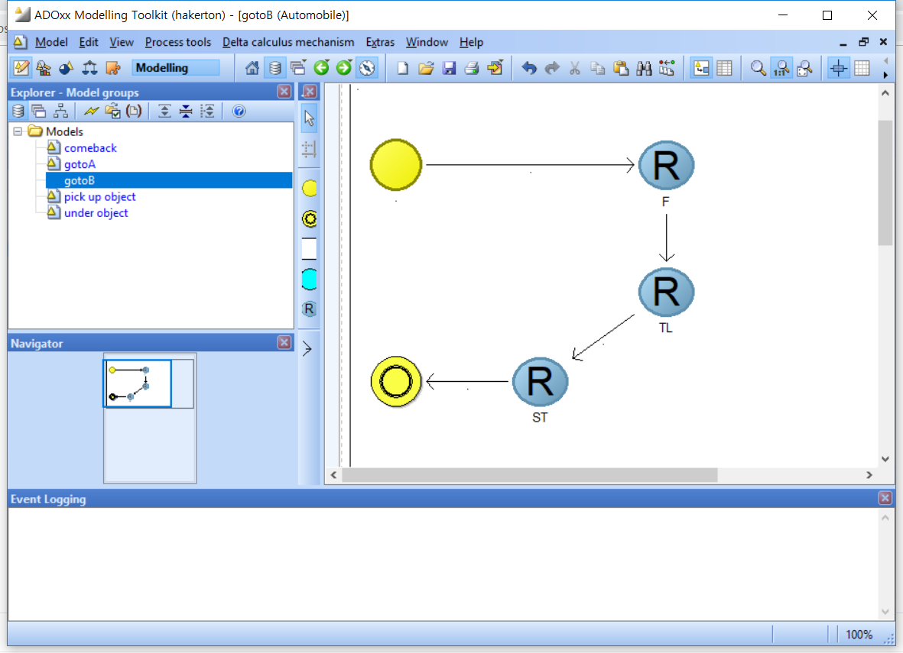
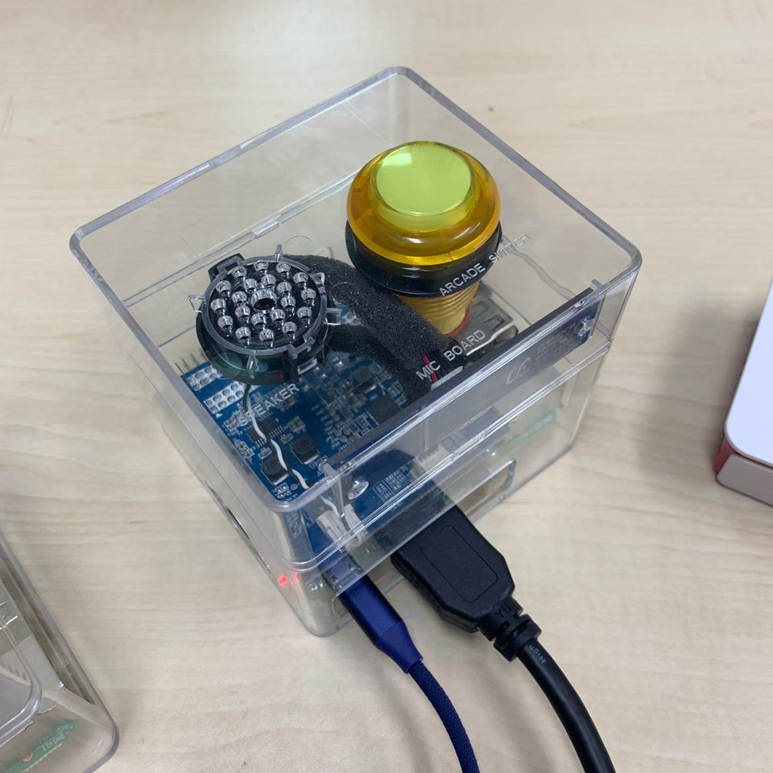

<h1>IOT-with-metamodeling-and-raspberry-and-aruino</h1>
<h2>Develops IOT using a metamodeling</h2>

The above program requires two laptops (servers, clients) and Internet modem and a raspberry pi with speaker and aduinos (robot arm, automobile).

install metamodeling program in cliend laptops with extended http protocols.
https://www.adoxx.org/live/download-15
 
## File Description 

.asc&nbsp;&nbsp;&nbsp;&nbsp;&nbsp;&nbsp;adoScript 

.adl&nbsp;&nbsp;&nbsp;&nbsp;&nbsp;&nbsp;modeling file 

.abl&nbsp;&nbsp;&nbsp;&nbsp;&nbsp;&nbsp;library file 

.js&nbsp;&nbsp;&nbsp;&nbsp;&nbsp;&nbsp;&nbsp;&nbsp;node js, javascript 

.ino&nbsp;&nbsp;&nbsp;&nbsp;&nbsp;&nbsp;arduino file

## Adoxx Server

1.node js 설치
 - https://nodejs.org/ko/
1.js파일 실행
 - cmd	
 - node hserver.js 실행하기위한 필수 module 설치
 - Error: Cannot find module 'express'
 - npm install express
 - Error: Cannot find module 'serialport'
 - npm install serialport
 - Error: Cannot find module 'request'
 - npm install request
1.hserver.js 코드 수정하기
 - 서버 코드 읽어보며 네부네트워크 설정등 필요!
1.공유기 설정
 - 내부 네트워크
 - ip 포트포워드 (express listen하기 위해)	
 - 192.168.0.xxx	프로토콜 tcp/udp	port 1xxxx
1.ip static 192.168.0.xxx로 변경
1.이후 웹에서 192.168.0.xxx:1xxxx/?id=adoxx
 - idle뜨는지 확인>>뜨면 express listen 성공
1.아두이노 블루투스 HC-06  연결하여 COM번호확인
1.hserver.js COM번호 편집
 - req.query.id 가 adoxx
1.방화벽 풀기, 1xxxx포트에 대해서 오픈

## Adoxx Client

1.Adoxx Development Toolkit 실행	 (Development Library import 후 User 추가하기위해)
 - 아이디 비번 Admin, password or Password//초기 아이디 비번
1.Libraries - Settings - Libraries Management - Management - import - Library import - Browse… - 해당 ABL파일 선택후 import
 - Library, Dynamic Library, Static Library 이름 변경후 저장
1.User - User list -  Add - User name 등 적고 - User group… - 빨간색금지버튼 클릭해서 초록색으로 바꾸기 - Add
1.Adoxx Modelig Toolkit 실행 (Import Models Using ADL Importl, model 실행 )
1.Import/Export(퍼즐모양) - ADL import (꺽인방향표) - Browse… - ADL파일 선택 -  Model in file:안의 모든 모델 선택 - Tar get Model 안의 model 
선택 - import (체크 안되있는거 있으면 체크)
1.Modeling - Extras - Shell window - asc파일 내용을 복붙 - Go!

## 에러사항

1.웹에서 주소에 192.168.0.20:1xxxx/?id=adoxx 쳤을때 idle가 안뜸
 - 공유기 또는 node js 또는 hserver.js코드 문제
 1.client 노트북에서 idle가 안뜸
 - 서버 노트북으로 접속이 안되는 문제
 - 공유기 포트 포워딩 또는 서버 노트북에서 포트 1xxxx에대해서 방화벽 오픈 또는 개인 네트워크 빼고 방화벽 승인

## Ai speaker

1. 라즈베리파이 조립
 - 케이스, 커버, 스피커, 아케이드 스위치, 마이크보드 부착
1. sd카드에 운영체제 설치
1. 라즈베리파이 세팅
 - javaScript 
 - python3
1. kt server open API 사용법 공부
1. nodejs 호환 통신
 - 내부인터넷
 - 외부인터넷
 - adoxx
1. adoxx와 호환문제 해결
 - hserver.js에서 오브젝트를 스트링으로 바꿈
 - 아두이노에게 데이터를 넘겨주는 방식 2가지 존재
  - hserver1.js : 모든 동작을 한번에 넘겨줌
  - hserver2.js : 한동작씩 나눠서 

